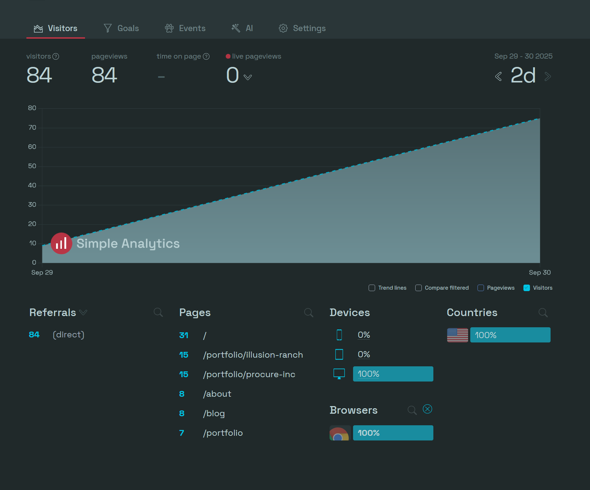
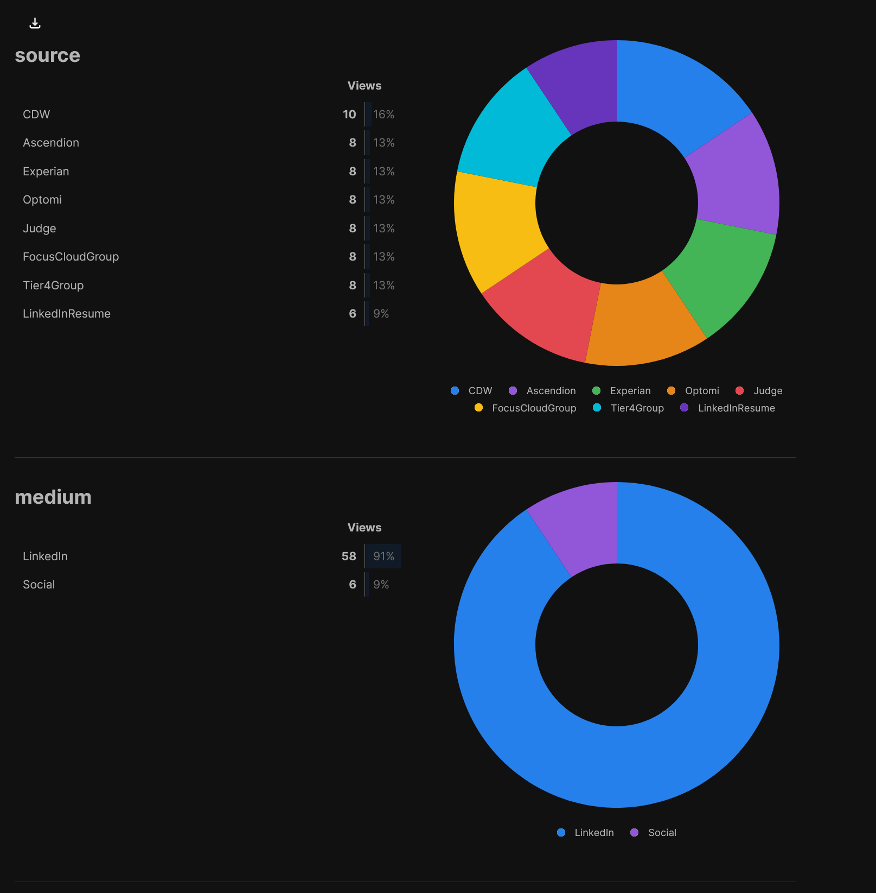

I'm job hunting, it's part of this whole site's purpose, and I don't know if I'm really getting any traction with potential employers. Is my resume being dismissed out of hand? Are employers tossing it? Are employers looking at my site and deciding I'm a bad fit?

I don't know where I am in the minds of HR and Recruiters, but I'm going to find out at least a little bit more.

# Web Analytics

It's perhaps common knowledge that everything we do online is tracked. Facebook tracks where your mouse cursor goes, Google cares about what you click and where you read, and everyone in the world is using tracking links. You've surely seen it in some URLs:

- si=
- igsh=
- utm_source=this&utm_campaign=that&utm_content=everything+but+your+sho+size

In practice it's easily missed. You share a [really cool video about youtuber Thin Matrix: https://youtu.be/2XY5Vn-VD_E?si=J6-CwsMqa6fWF5Ad](https://youtu.be/2XY5Vn-VD_E?si=J6-CwsMqa6fWF5Ad) and suddenly youtube is showing you and your friends the same videos. That little SI= does a lot of work. It connects your account with any account that clicks that link, builds out that network of people you know, and feeds the algorithm powering Google's mighty data-marketing-behemoth.

Well. I have a website. Why can't I use some analytics too?

There are dozens of companies competing in the space, most offer a free tier for a site or two or for limited features. Google Analytics is free too, but I wanted to try to spread my wings a bit and try other companies. Thus we have: simpleanalytics and umami. These are two companies providing a nice, free tier of access to see who's accessing my site.



Something is missing from this picture. We don't know WHERE the viewers are coming from. In principal, that resume I sent to IBM could be circulating around the entire executive suite saying amazing things about me. I could have applied to 100  jobs and 100 bots all swarmed my site at once for a peek and a sip of data.



It's a good thing my links all had trackers!

We can add attributes to a URL like:

https://hirethis.one/?utm_source=blog&utm_campaign=demonstration&utm_content=blogLink&utm_medium=web

In my case, I modified all the links in my resume to slip in tracking like this. Now I know when a potential employer looks at my resume, and I know when they don't. Mostly. A fair few of these appear to be bot traffic, automated tools as part of the application process. The timing of when an application was sent vs when the site was accessed would certainly suggest some digital intervention.

It's still better than nothing.

# A Little Automation

I didn't do this little exercise and post just to leave you empty-handed dear reader! You too can do the same as I have!

While the analytics setup is far beyond the scope of this blogpost, I have written you a tool to make your job a little easier. We send our resumes in to most jobs as PDF files. Python can edit a PDF file.

I wrote a python tool that generates a customized PDF per job application. The links in my resume that I want to edit all contain a simple string:

> ?placeholder

My script opens the PDF, gets all the links, asks for what I want to use for my tracking, and then does the simplest string.replace() on the URLs in the links to update them with that information. As a bonus, I also put in a simple "&utm_content=" for each link, so I know what specific links are getting clicked.

So, the tool, what do you need? Python 3 for starters. And then you'll need pdfrw. Grab Python from [https://python.org](https://python.org), install that, and then use PIP to grab our pdf package:

&nbsp;

```
pip install pdfrw
```

&nbsp;

The most up to date version of the script will [be on github gist](https://gist.github.com/NXSam/acf70162605ed096bdaec1c577f2b5f4) as I find ways to upgrade and improve it. I'm tempted, very tempted to make a little UI for it.

Or you can copy some potentially slightly outdated code from right here:


import { Code } from 'astro:components';


<Code code={`"""
Resume.py

This script will search for URLs in a PDF containing the text "?placeholder" and replace that text
with UTM Source, UTM Campaign, and UTM Medium variables from a prompt.

Using these variables, plus a website with analytics will allow you to track who has seen that PDF document.
This is ideal for sending employers resumes containing your portfolio and other sites where you have analytics.

It's recommended to set UTM Source to the Employer, Campaign can be used to describe the month/year or other aspects of your job search
Medium is often used for social/email/etc but can just as easily be set to the name of a job board to better track results.


"""


import tkinter as tk 					#Import UI
import pdfrw						#Import PDF Lib
from tkinter import filedialog			#Import File Dialog Box

name = "_"+"NAME-HERE"+"_"				#Set name as a variable for easier customization
utmsrc = input("UTM Source: ")			#Get the Source (Job Name) variable
utmcmp = input("UTM Campaign: ")		#Get the Campaign variable (any way of describing/naming your job search effort)
utmmed = input("UTM Medium: ")			#Get the Medium variable, this is often 'social' or 'email', but can also be the name of the job board applied


#Build the tracker string to go on the URL
urlEnd = "?utm_medium="+utmmed+"&utm_campaign="+utmcmp+"&utm_source=" + utmsrc

#Load TKInter for a file dialog.
#This could be done in the terminal as a file path, but the UI is just an easier way
#of getting a file path and less prone to typoes and errors

root = tk.Tk()
root.withdraw()
file_path = filedialog.askopenfilename()

#Open our PDF Resume and create an output to save the edited resume.
pdf = pdfrw.PdfReader(file_path)
output = pdfrw.PdfWriter()


#Check every page in the PDF.
for page in pdf.pages:

	#On every page look for Annotation (annot) elements
	#Check if the annotation contains a URL. Skip if it doesn't.
	#If the annotation DOES contain a URL, replace the string "?PLaceholder" with the tracking string
	for annot in page.Annots or []:
		templateURL = annot.A.URI
		if templateURL == None:
			continue


		new_URL = templateURL.replace("?placeholder", urlEnd)
		annot.A.URI = pdfrw.objects.pdfstring.PdfString(new_URL) 	#Update the annotation URL. It must be done this way. All others will break.


output.addpages(pdf.pages)									#Add pages to the output PDF
output.write(file_path.replace(".pdf", "")+ name + utmsrc + ".pdf")				#Save the output with a unique name`} lang="py" />


This script will search for URLs in a PDF containing the text "?placeholder" and replace that text
with UTM Source, UTM Campaign, and UTM Medium variables from a prompt.

Using these variables, plus a website with analytics will allow you to track who has seen that PDF document. This is ideal for sending employers resumes containing your portfolio and other sites where you have analytics.

It's recommended to set UTM Source to the Employer, Campaign can be used to describe the month/year or other aspects of your job search
Medium is often used for social/email/etc but can just as easily be set to the name of a job board to better track results.

All you have to do is download this or put it in a .py file and replace NAME-HERE with your own name. The rest will take care of itself. Simply run the file from command prompt/terminal/bash with python resume.py.

You'll be prompted for your source, medium, and campaign values, then a file browser will appear for your resume. Remember your resume MUST have ?placeholder added to each link you want to put trackers on.

Hit enter and you're all done, custom resume.

This is much, much faster than manually editing a resume and more importantly, it can give us all some insights about how we pursue our job hunts.


