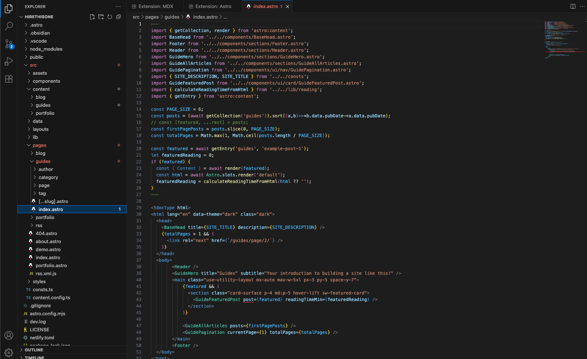
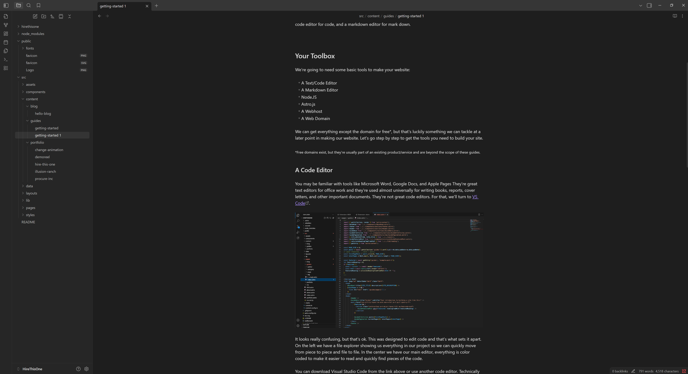
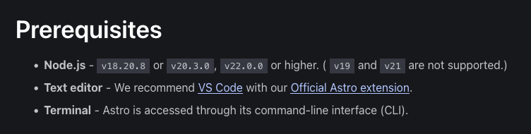
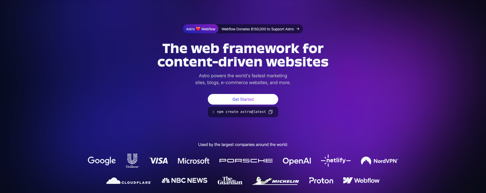

Building a website means getting together some tools for the job. You could do it the hard way and use nothing more than the built-in Notepad on windows and whatever browser you have on hand, but we have better ways to do it. You use a hammer with nails, screwdrivers on screws, a code editor for code, and a markdown editor for mark down. 

## Your Toolbox

We're going to need some basic tools to make your website:

- A Text/Code Editor
- A Markdown Editor
- Node.JS
- Astro.js
- A Webhost
- A Web Domain

We can get everything except the domain for free*, but that's luckily something we can tackle at a later point in making our website. Let's go step by step to get the tools you need to build your site.

*Free domains exist, but they're usually part of an existing product/service and are beyond the scope of these guides.

### A Code Editor

You may be familiar with tools like Microsoft Word, Google Docs, and Apple Pages They're great text editors for office work and they're used almost universally for writing books, reports, cover letters, and other important documents. They're not great code editors. For that, we'll turn to [VS Code](https://code.visualstudio.com/).

It looks really confusing, but that's ok. This was designed to edit code and that's what sets it apart. On the left we have a file explorer showing us everything in our project so we can quickly move from piece to piece and file to file. In the center we have our main editor, everything is color coded to make it easier to read and quickly find pieces of the code.

You can download Visual Studio Code from the link above or use another code editor. Technically speaking, even Microsoft's built-in Notepad app can edit code, but it's not a great experience.

### Obsidian

This is an optional item in our list. Technically speaking, VS Code can do Markdown editing.  Obsidian spans the distance between a code editor and a document editor. It's focused just on the Markdown (MD) format we'll be using to write our blog posts, it has the same file tree feature as our code editor, and it is very extendable. There's plugins to add features and abilities like sync'ing to Dropbox.

 In recent years, Obsidian has been growing in popularity for its ease of use, simplicity, ability to integrate with other apps/tools, and just plain ability to do nearly anything. It's [been used for DnD Campaigns](https://www.youtube.com/watch?v=DFBG3N68LKQ), [complex notes and organization](https://www.youtube.com/watch?v=worpx0LOeII), and really just anything that needs to be written down, structured, and organized without needing a ton of complex systems.

We'll be writing our blog posts and other content in it, making it easy to stay organized and see what our posts look like as we write them (yep! That's a novelty in the development world. You don't  always know what something looks like until it's done. Unless you use the right tools).

### Node JS

Computers run on programs and there's different languages for them. You might hear about C++, Javascript, Python, PHP, Rust, or dozens of others. Some of these have built-in support on your computer and others need to be installed. In this case, we need to install [Node.js](https://nodejs.org/en) from their website.

Why do we need node?

Astro is coded in Javascript and built to be used with Node. You'll come across the idea of Dependencies in programming sometimes. The technology you use all strings together. Astro depends on (needs) node to function. The tools we work with are all built on a hundred other tools that all string together into this enormous system that gives us the modern computer, the internet, and our digital world.

### Astro

The key to building our entire website is Astro. When we make a website, our first choice is perhaps:

>Do I build this completely from scratch or do I build on something else?

We're going to build with a tool that already exists. More than that, we're going to build with one that makes our lives quicker and easier. Astro helps us to simplify our work. It can put parts of the website together for us, so we can focus on editing just a few files. It's like have a form, everything is already in its place, we just have to fill it out.

You can [read more about astro at Astro.build](https://astro.build). We'll cover installing it later. Thanks to Node JS, we can install it with a built-in command directly from node. It's another thing that makes our lives a little easier.

### Domains and Hosting

Domains and Web hosting are both services provided by a third party company. When you go to a website like Amazon or Netflix, you're using their Domain to do so - Netflix.com is a domain. We register a domain with a 3rd party provider like [Cloudflare](https://cloudflare.com), [Spaceship](https://spaceship.com), [Porkbun](https://porkbun.com), and many others. We pay a yearly fee to be the unique owner of a given name. I paid for [HireThis.One](https://hirethis.one) from a registrar.

Web Hosts are much the same. We'll select a host who'll store our website on their servers and make it available to whoever types in your site name. Some hosts offer free services such as Cloudflare and others will charge, like Amazon.

Later in these guides we'll cover the process of deploying your site on Cloudflare. Other services will offer a similar process.

