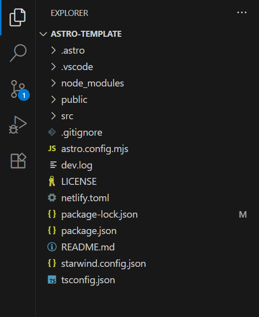
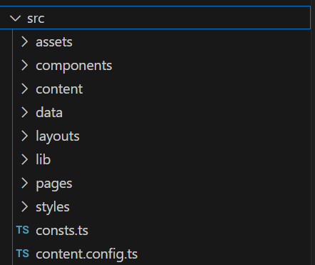
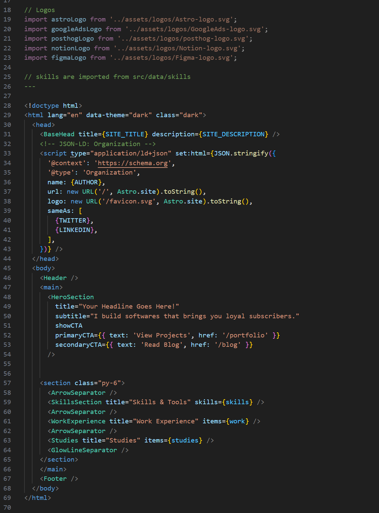

The guides so far have covered development tools, static site generators, and creating a real time/interactive site preview using Astro JS. In this guide, we will look at how the site's files are actually laid out. Everything has a place and there is a place for every thing. This methodology ensures an organized project that any developer can work with and it simplifies the site's code with repeatable and predictable patterns.

If you haven't already, open Visual Studio Code and choose the Open Folder option. Browse to your website and open it. You may be prompted to install extensions and trust authors. VS Code can load some included modules designed specifically for Astro projects and Markdown files. If you're willing to trust these projects, click Trust, Install, etc as prompted. If not, select Don't Trust and install extensions of your own choosing later.



Clicking the top left icon will show a directory tree like this. Clicking any arrow will open a drop down to show its contents.
# Basic Config Files

The core of the website relies on a combination of template files and some directions about how to use those template files. In our main directory, there are the files:

```
starwind.config.json
astro.config.mjs
package.json
tsconfig.json
```

What is a JSON file?

These are JavaScript Object Notation files. They format text in a way that is readable both to a computer and to regular developers. These can be called "Human Readable" because there is nothing encoded in these files. A person can understand them.

Open astro.config.mjs in Visual Studio Code. 

```
import tailwindcss from "@tailwindcss/vite";
// @ts-check

import mdx from '@astrojs/mdx';
import sitemap from '@astrojs/sitemap';
import { defineConfig } from 'astro/config';
import tailwindcss from '@tailwindcss/vite';

// https://astro.build/config

export default defineConfig({
    site: 'https://example.com',
  integrations: [mdx(), sitemap()],

  vite: {
    plugins: [tailwindcss()],
  },
});
```

This file is doing several things for the site. It's specifying plugins, loading some code, and most importantly setting the URL for the website. In the future, "https://example.com" will need to be replaced with your site's real domain.

Starwind.config.json and tsconfig.json are similar in that they perform essential functions for building the site, but largely won't have to be altered at this stage.

Package.json controls how npm works. Open that and look through its contents. The dependencies section lists the code required to create the site. These pieces of code are stored in node_modules, there generally won't be any reason to open or work in that directory, it's handled by Node. The top half can be used to track the name of the project, the version of it as you revise it, and so on. Does anything else stand out?

In the prior guide, npm run **dev** was used create a preview of the site and here **dev** is listed again. This file allows additional commands to be defined. The command npm run build or npm run preview will likewise run commands to create a final-release version of the site and a static preview.

# Public and Source

The Public folder contains static assets. These are files that Astro won't be altering or reading, they're just copied verbatim to the finished site. These are still very much important files for the project, but they play a different role. Font files, the icon for the site's titlebar, and directions about web crawlers (robots.txt) all go in here.

If your site were to host a file like a PDF document, a resume or something of that nature, it would go in the public directory somewhere.

src or Source is where all the dynamic and coded pieces of the site are stored. These are files that Astro will read, string together, edit, and alter to build the final site. Images store in this folder will be optimized to faster performance, blog files will be turned into blog web pages. Everything here is meant be dynamic. 



There are two important files here that should be tweaked right away. First, consts.ts:

```
export const SITE_TITLE = 'Site Author – Personal Blog & Portfolio';
export const SITE_DESCRIPTION = 'Growth engineering, analytics, and product marketing notes. Case studies, experiments, and projects by Site Author.';
export const AUTHOR = 'SITE_AUTHOR'
export const TWITTER = 'https://x.com'
export const LINKEDIN = 'https://linkedin.com'
export const HANDLE = '@handle'
export const SITE_URL = "Example.com"
```

These values control what the site's name shows up as in various pages, impacts how it'll show up in search results online, defines the default author's name, and sets the social links across the site. Take a minute to fill these out and save the file. The next time a preview is generated, the site's contents will update accordingly.

The content.config.ts file defines data related to the blog system. It shouldn't be touched just yet. Editing this file and some code in the blogs would allow for replacing the header images with a header video or including other metadata in the blog. They're modifications for a later guide or your own explorations.

Many of the other folders will have similar files. The Data folder contains author.ts, studies.ts, work.ts and other files. These files all contain content that shows up across the site. The Projects.ts file is used to create the portfolio page. By editing the contents of this file, it will edit the contents of the portfolio page.

The Components, Lib, Pages, and Layout folders contain the code that makes the backbone of the site. These files specify where and how content goes on the site, what the pages will look like, and so on. Most of them are .astro files.



There are sections named WorkExperience and Studies, corresponding to the work.ts and studies.ts files.

For those with some familiarity with web development, this looks remarkably similar to an HTML file. In large part, it is. Astro uses HTML type formatting and simply adds its own systems for dynamic code and variables to create templates, link files together, and build the website. Essentially whatever works in other web development works the same here, but now files can be imported and embedded together and have dynamic content. 

The Styles folder too, will be familiar to other web developers: it's just CSS files. These are Cascading Style Sheets. They define rules and parameters for how the website will look. By changing a single value in these files, a change can be made across the entire site. 

Lastly, there are two more important folders.

## Content and Assets

The Content folder is perhaps where Astro truly shines. In other approaches to building a website, every page would have to be manually coded in HTML. Even without manually coding every piece of those pages, everything would still need to be HTML, it's less ideal as an actual writing format.

Astro supports other file formats. Most crucially Markdown. 

``` example-post-1.md
---

title: 'Example Post One'
description: 'Sample article demonstrating the blog layout, cards, and meta.'
pubDate: 'Aug 12 2025'
heroImage: '../../assets/images/example-blog-hero1.jpg'
category: 'Showcase'
tags: ['template', 'demo']

---

  

This is a sample article used in the starter template. Replace it with your own content.

- Edit the title, description, and frontmatter
- Drop your images into `src/assets/images/`
- Update tags and categories as needed
```

Notice the Title, Description, pubDate, and other lines. These are all defined in the content.ts file mentioned earlier. These can be filled out here, allowing Astro to process this information into useable content on the web page.

At the same time, the blog post is just simple text. Including a little dash creates a bullet pointed list. Using an asterisk denotes an italicized piece of text. It's quick and simple. Astro will read this and translate it into perfect HTML later, simplifying the blog writing process. Nothing special is needed to write a markdown blog. Tools like Obsidian do however, make it easier.

Finally, the Assets Folder. This folder contains all the images and other similar items. At first thought, they should go in the public folder right? Modern web technology involves significant efforts at optimization. By changing the format and size of images, they can be made smaller and load faster. Files stored in assets are processed and optimized by Astro. Some additional code can be added to process other file formats or integrate the assets more directly with the content system.

# Staying Organized

As this project progresses, we will begin to modify the template to fit our needs. We'll add material to some files, remove other material, build and customize this site to fit your needs. Remember the organizational structure of the site, it'll help to locate files and know where to place new files in the future.

Everything in it's place and a place for everything.