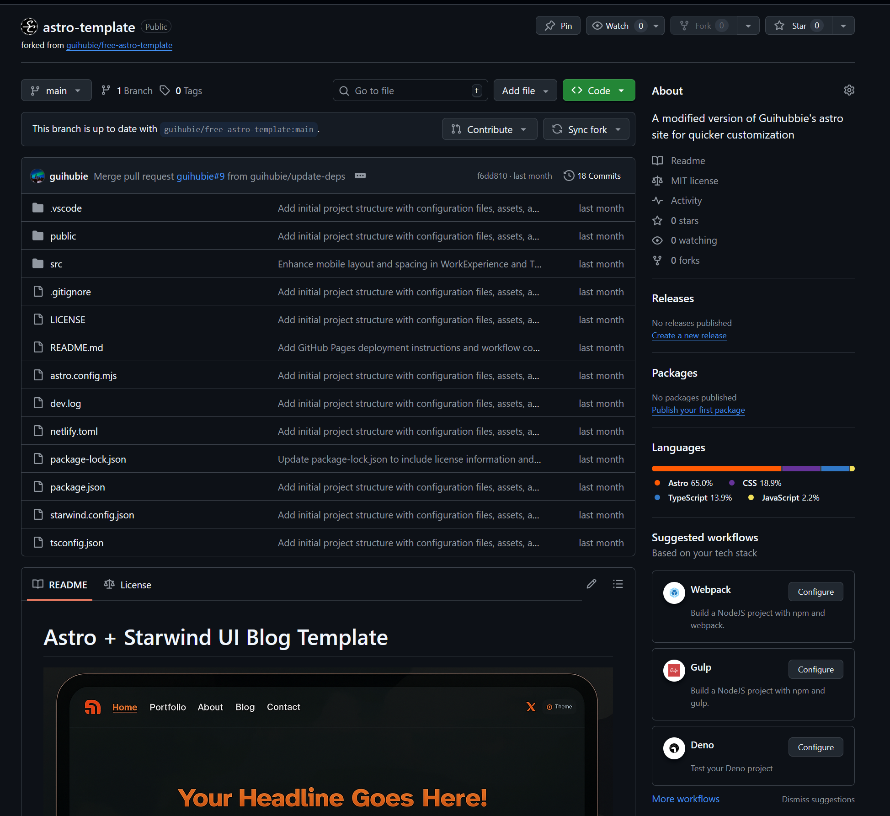
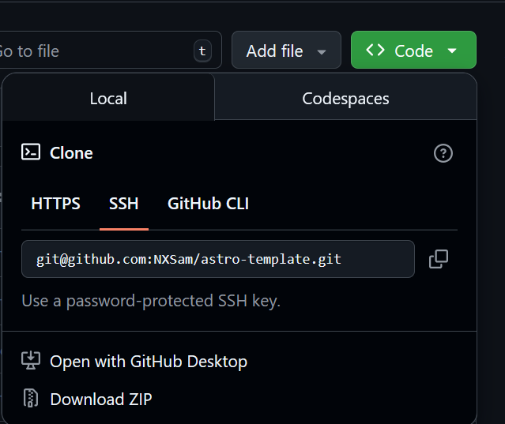
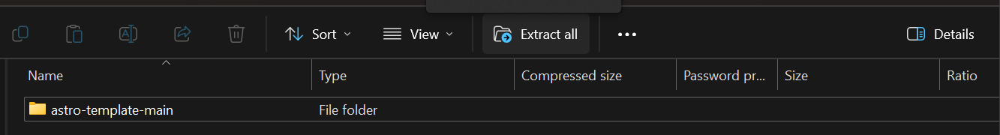
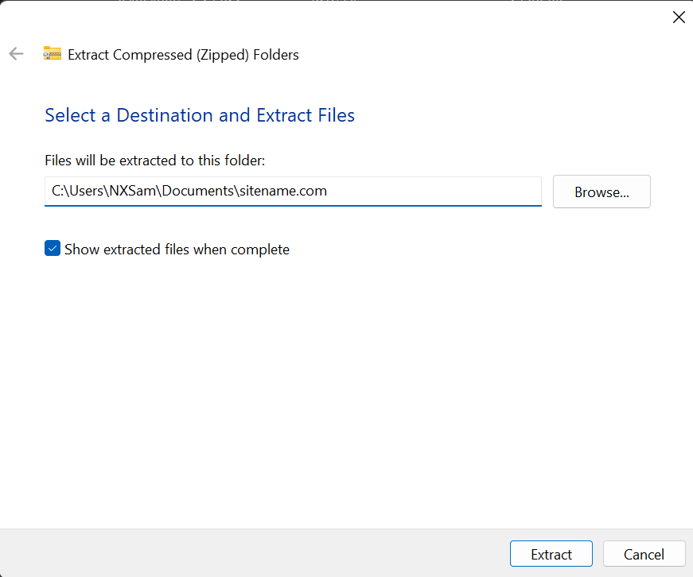
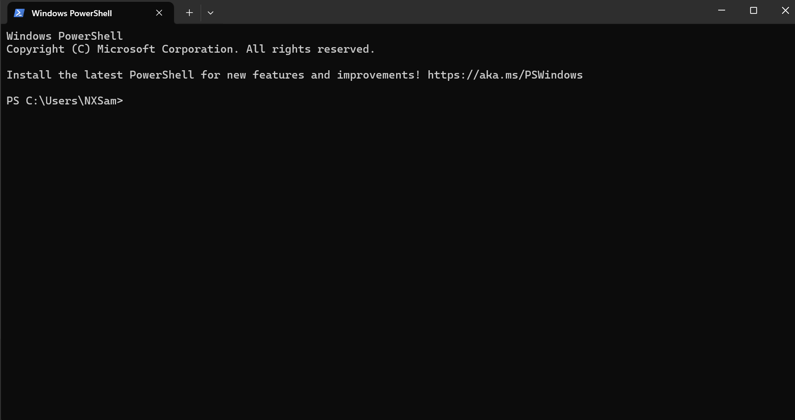
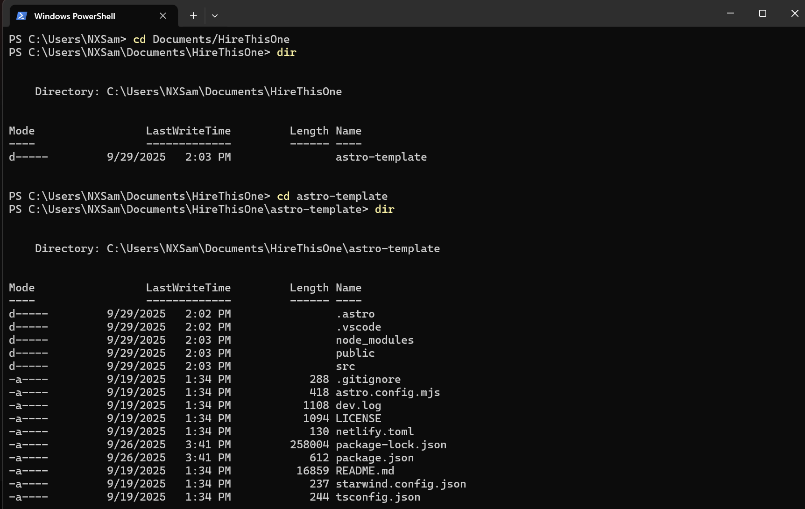
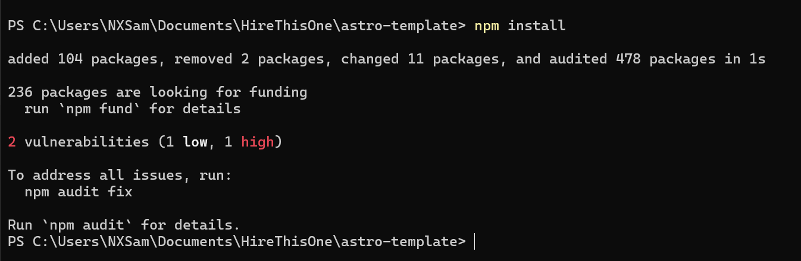
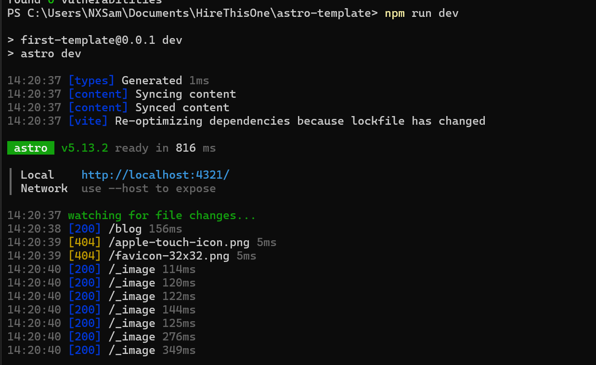
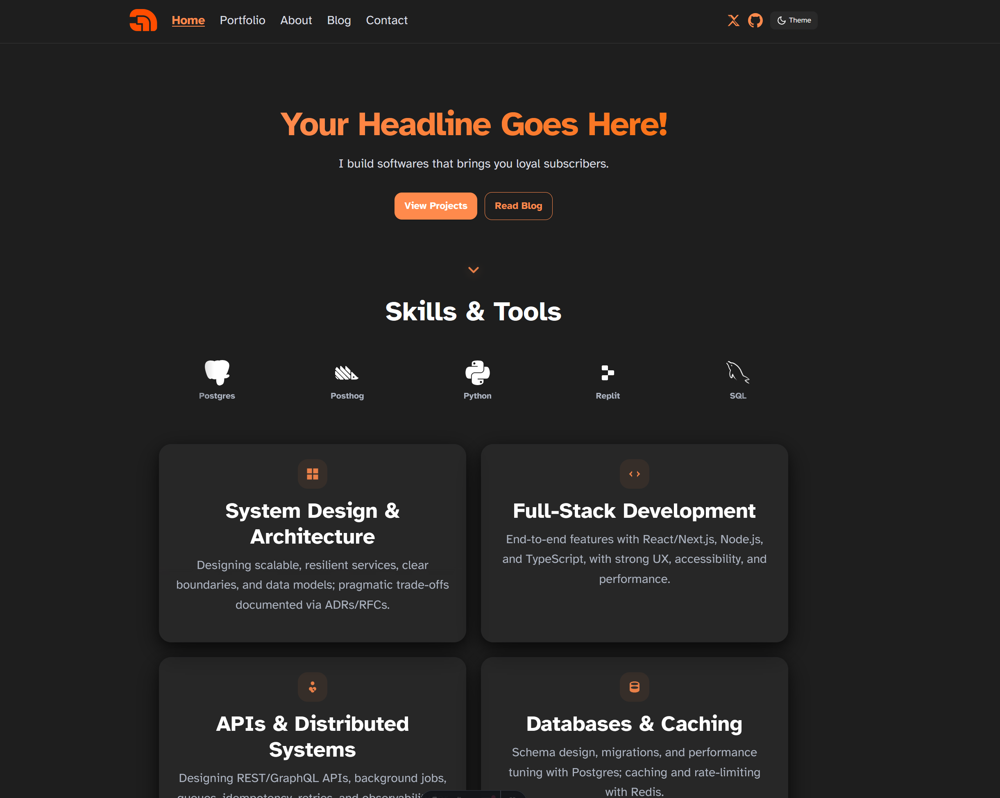

Web development from scratch is difficult, especially when you're working on your first website. The shear scale of options and decisions in front of you can be crippling. Do you make a static site? Code in PHP? What about using a platform like Wordpress? Do you use a specialized host?

For a first-time project, it's easier to just run with a template. The world is full of free to use (and paid) templates that we can readily customize to fit almost any purpose. This site was based on a [a template created by guihubie](https://github.com/guihubie/free-astro-template). We're going to do almost the same thing.

A modified version of that template [can be downloaded from github](https://github.com/guihubie/free-astro-template). 

## Options for Downloading

There are decisions to make, even when just receiving a freely-made and ready to go piece of code. To download the template, click the green Code button near the top of the page. This is going to present some options.

>What does all of that do?
>-<cite>Every First-Time Git User</cite>

In the development world, there is a tool called GIT. It's main purpose is to store versions of code and allow multiple people to work on a project at once. This system lets two people edit the same file and it can merge those changes together into a coherent end result without breaking everything. If you have a Git client, you can copy the information above into it and it'll download the files and help you download updates, manage revisions, and even contribute code back to a project.

If you've used Git before, feel free to clone the repository. If not, let's keep this simple - click Download ZIP.

This little file contains the entire website in its current state. You can't just upload this yet though, it's built using Astro and we'll need to use Astro to turn this from Source Code into a working webpage you can view. Let's get a working preview.

Open the zip file, on Windows this will open a preview of its contents.

Extract it to your documents folder as follows, somewhere we can find it quickly and easily. The rest of these guides will assume the site is in your Documents. Feel free to rename the site, it is often best practice to name the folder for the website's name.

On Mac OS, double clicking will extract the zip file in the same folder, so you'll need to double click that, rename it, and move it to your Documents folder.

If you're a linux user, the exact process will vary between distros.

## Previewing the Site

To create an actual preview of the site (and do many other things), we need a Terminal. On Windows you can use Command Prompt or Power Shell. Mac OS has the Terminal app. Linux has several terminals that are usually listed as BASH or Terminal.

On Windows, use the Start Menu or Search to find Power Shell. On Mac OS, Spotlight can open Terminal by searching for Terminal. In either case, you'll get a window that looks similar to this screenshot.

Everything we do here has to be typed, in some cases you can right click to copy or paste. Hitting Enter will cause a command to run. You will need to have Node JS Installed from the prior guides to continue any further.

We need to use 1 command to open the folder with our site in it.

> cd Documents/WebsiteFolder

CD tells the Terminal we want to Change Directory. We want to open Documents and then go into the folder named WebsiteFolder. In your case, change that to whatever you named the project. 

Hit Enter and the command will run.

If you followed the directions exactly, on Windows, we'll need to CD one more time:

> cd astro-template

On MacOS, you're probably in the right place. Different OS's means slightly different outcomes to unzipping the files.

We can use the DIR command to list out what's in the folder, if everything's gone right, you'll see something similar to this.

We are two commands away from seeing your site!

> npm install

We're going to have Node JS install everything it needs to show our site. For this we use NPM, the Node Package Manager. There's already directions in our source files to tell NPM what it needs.

You may see warnings about vulnerabilities. To make a long-story short, computer code is changing all the time. The code we use can have security issues. Node JS/NPM documents what code could be a problem and it informs you of that. Running NPM audit fix will download fixes/updates for vulnerable code and apply them automatically.

> npm run dev

Now let's see that site!

We're going to tell npm, node package manager, to run a pre-made command called dev. This will start up Astro and tell it to make a preview of our site, that we can then see live on your pc. 

On windows you can control-click the URL, "http://localhost:4321" to preview your site. On other OS's, you'll need to copy/paste the link. Put that in a browser of your choice and you'll be set to see your site!

Remember the steps we took to get here. You will need to open the terminal again and you'll need to navigate to your site folder. Whenever you're doing development work or updating your site, you'll need to come back and run these commands:

>npm run dev

Generate a preview of your site and create a temporary webserver to show it.

Other commands add features/resources to your site and will be used to put your site live. Those will be covered in future guide updates/
