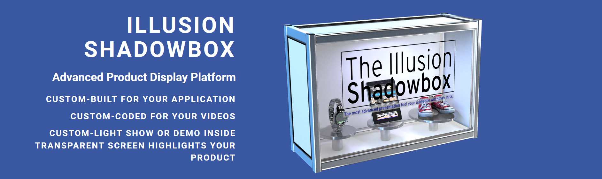
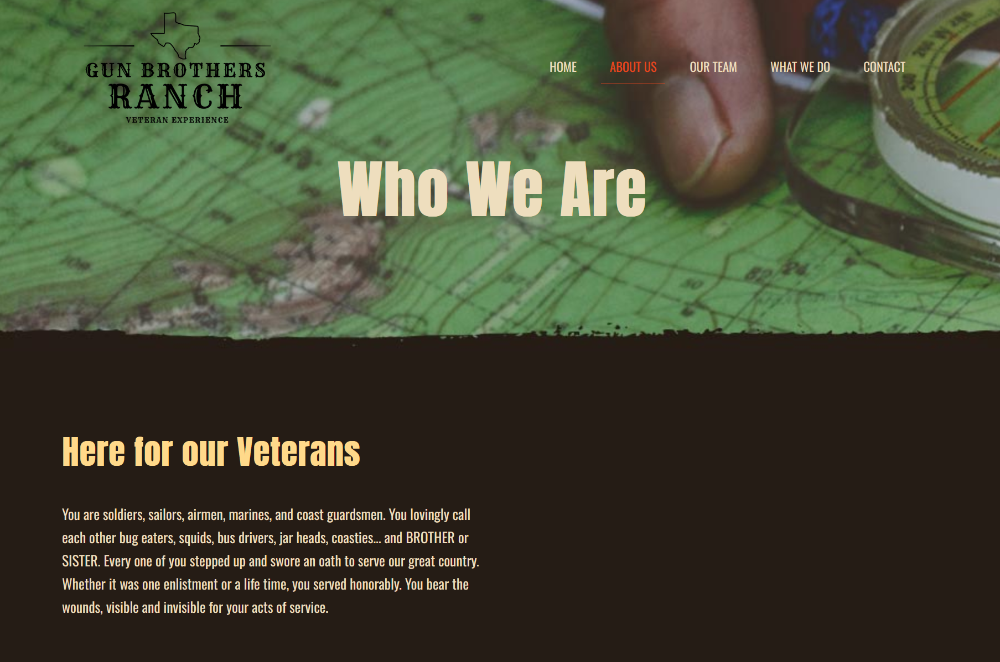
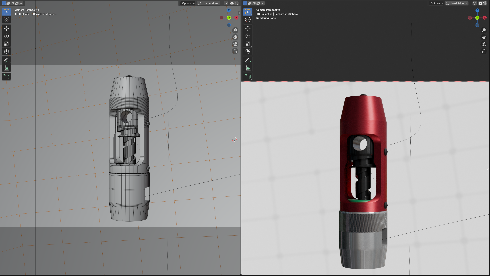

Illusion Ranch is a small Pennsylvania based production company, event venue, and actual functioning alpaca ranch. They produce ads, training videos, websites, and even product prototypes for companies all over the world. Their team's shot on 6 continents and won awards for their work. 

My work at Illusion Ranch could perhaps best be described as "everything under the sun and then some."

## Simple Editing

My first role at Illusion Ranch was simple video editing. It was grunt work. The team would shoot a ton of interviews and they'd want the individual sound bites/clips broken out. There could be four, six, or more hours of interviews. It'd take maybe 30 seconds to ask a question, two to three minutes to get the answer from the interviewee, and lots of empty space in-between.

Worker smarter, not harder.

I used the audio preview to see who was speaking and played the clips back at up to four times their proper speed to just fly through the timeline cutting out the unnecessary parts. This was a task to be done and I wanted it done fast. It wasn't quite something we could automate, but it was so painfully close. Just make some good shortcuts and don't stop til' it's done.

## Beyond Editing

There's no way I was just an editor. Shortly after starting, the team took some interest in upgrading some of their websites and even prototyping some in-house video products. Well, I knew a coder - me.

### The Illusion Display System

One of the ranch's clients had an idea for an automated demonstration cabinet. The idea was to play a video and a series of actions would synchronize to the video. In the old days, Disney did this type of work with magnetic tape - two audio tracks for actual audio and then every other track had data to drive machinery. That was the 60s and this was the 2010s. Technology had improved a little bit.

I introduced the team to the venerable Raspberry Pi. They were ubiquitous, affordable, adaptable, programmable, and very flexible. My first prototypes were written in python, it was messy and the sync wasn't perfect, but the concept worked. We would play a video on screen through python, track the time, and signal a series of relays to turn on or off based on the video time code. We had buy in from outside clients.

As the project progressed we brought in outside developers, switched to Node JS, and grew our ambitions. I envisioned having an infrastructure to manage each unit in the field for remote adjustments and updates. We could put webcams in them to monitor peoples' reactions. The sky was the limit to what we could achieve.

### Web Development

There was more to the business than trimming videos and making experimental display prototypes. The ranch had at least half a dozen sites running at any given time, covering all aspects of the business. Over the years we've followed trends in technology, design, and marketing, upgrading and improving with each step of the way.

The Ranch moved from a static site to a Wordpress site, but there were security issues. I built a VPS and locked it down tight. No more security issues and we had a much prettier site that better represented the brand at-large. The team wanted to branch out and pursue more government contracts, so we spun up a new site. We onboarded a construction contractor client and built a site for him.

In making a video for Mars, makers of M&M's, I was brought on to make a training site for a Mars-branded coffee machine. Users had to be able to click on the coffee machine to show every single piece and relevant training materials for repairs and replacements. The videos had to be deployed on Mars' web systems and work with a launcher on a flash drive. Anything I made was an upgrade, the prior training system was built in the then long-deprecated Adobe Flash. 

Most recently, the Ranch has offered support to a Veterans' non-profit. They needed reliable email access and a website. The Ranch had its problem solver ready to coble, experiment, and build the perfect solution. About a month and a dozen hours from the start we put [Gun Brothers Ranch](https://gunbrothersranch.com) live for disabled veterans.

### Visual Effects

Let's not forget where I started, video production. The Illusion Ranch team shoots videos all over the world and that can mean anything for a video:

- Make something disappear
- Fix a make up issue in footage
- Fix a bad recording/microphone
- Make a 3D Training animation
- Showcase a giant globe made of thousands of pictures
	- This one's not actually finished yet. The end-client is debating the globe-shot.
	- I half dread trying to load 50,000 individual employee images into any 3D package. I might have to code something clever.

One such effects project was a training series about proper networking assembly and maintenance. I was handed pictures of this incredibly complicated tool and told to model it for an animation. This is the sort of model that sets CAD modelers and mesh modelers apart. In CAD this is just a few booleans and parametric tools away from being done. In the mesh-modeling world, booleans don't always work, every step has to be carefully planned, and you have to be careful about introducing mesh errors.

I think I nailed the look. Our end-client was happy with it, even if I animated it spinning backwards in the first rough-animation. I'm far from infalliable, but it was a funny realization. 

## Illusion Ranch Today

The founder's on my resume as a reference today and I field calls for new projects all the time. This is one of my longest running clients, I think almost a decade of work whenever the ranch needed a new graphic, model, site, or effect done. I'm the fixer sent to make problems go away.

