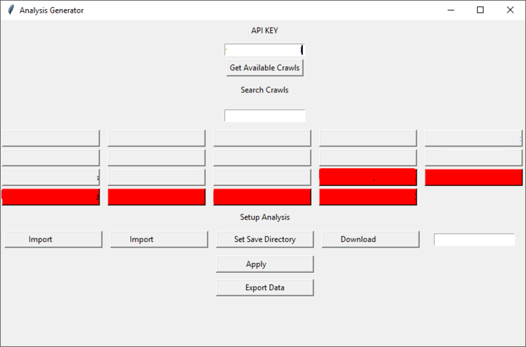
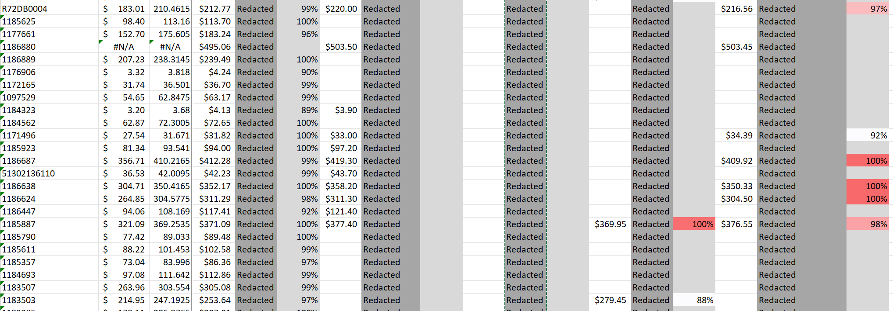

Procure Inc. is a small HVAC Wholesaler and one of my longest running employers. I started working there before I even founded my business. At the time we had a small office and we did a lot of work by hand. When we wanted to update our pricing, we'd go to 10 or 20 competitors, write down the pricing for 10 or 20 products, and adjust our own pricing based on that small sampling of the market. At the time it was just my job to make pricing sheets, send some emails, and answer the phone.

I care far too much about my work and focuses too much on working smarter than harder for that to have stayed the status quo for long.

## Bringing My Skills

I don't think there's a corner of Procure's Business I didn't try to improve, and my boss was onboard the whole way. A small list of my accomplishments includes:

- Transitioned the company to GSuite off of our Registrar's cheap email service
- Automated product pricing and analysis with Python scripts, excel formulas, and web crawlers
- Shepherded the site through several iterations and redesigns
	- Magento, Shopify, and Big Commerce eCommerce platforms
	- Developed a spin-off/secondary storefront
- Created and managed the [Procure Inc. Blog](https://web.archive.org/web/20220811172404/https://blog.procureinc.us/)
- Created Procure's current logo
- Managed In-House IT Systems & Provided Tech Support
- Created graphics and ads for both the site and social media
- **Set the company up for remote work before the pandemic**

My job was to deal with pricing and emails, but I always wanted to get the work done better and faster. Sure, I could calculate out a bunch values by hand, but we had Excel. I could get data by hand, but why do that when web crawlers exist? We had more products on the site than our host could handle, so why not just build the company a new site on a bigger and better platform?

Each step of the way, where management saw problems, I saw opportunities. 

### The Web Crawler

Among the many things I made, I think the web crawler/analyzer might be the one most interesting to other developers. It was something stupid, simple, and it shaved at least 3 hours of work out of every pricing update.

At the start, I knew some python basics. Who doesn't, right? Everything is tab based, pip is baked in, just ask it to do what you want. My coworkers weren't tech savy, so it needed a UI as well and TKInter was good enough (if admittedly kinda ugly). 

The process was pretty straight forward:
- Use the Crawler App/Service to get the data
- Input your API Key
- The buttons populate with crawl names, red means outdated crawl/don't use it.
- Make your selections, feed it a current pricing sheet, apply the pricing sheet, and export your data

What saved the most time was feeding in all the excel formulas. 

Every competitor was lined up across products, blank spaces where they didn't offer that product, and dynamic color coding to show where we might lose a sale. The whole system let us finesse our pricing across the line and fine-tune a sales strategy for optimum sales. At the same time, we could see patterns in how our competitors were pricing their products. A string of products all selling at 20% higher costs? Looks like people will pay more for a given line of compressors or thermostats at the moment.

### Going Remote Ahead of the Curve

When I started with Procure, we just emailed files around the office. The company hadn't reached the point of having servers, cloud storage, or shared file access. A sales lead would receive new pricing data, distribute that to each person to work on for the day, and we'd upload new pricing to the webstore. It was inefficient and there were always risk of errors: what if someone else had a more up to date copy of a pricing sheet, but they were out sick? What if snow storm kept us out of the office?

The move to GSuite brought us Google Drive, shared files, and slowly I started to spread my tools through our small business. The company's founder could comfortably take a vacation anywhere in the world, still access the company's resources, and spend an hour or two on important business with absolute ease. Nothing we did necessarily had to be done in the office and being able to work snow, shine, or global pandemic paid off.

By the time COVID hit, the lockdowns were nothing for the company. Everyone had secure web access, our work was digital, and we went work from home for all the office and sales work. While companies all over the world had some growing and transitioning pains to remote work, our little team was already meeting in Slack and powering our way through the world-wide sales slump.

## Keep Building Better

Every job or task is an opportunity to make something better. With Procure, I've spent every chance I could streamlining, upgrading, and improving. That doesn't mean taking a wrecking ball to the successful processes we have. It means finding the little pieces and making them better. String enough little upgrades together and you get a massive improvement.